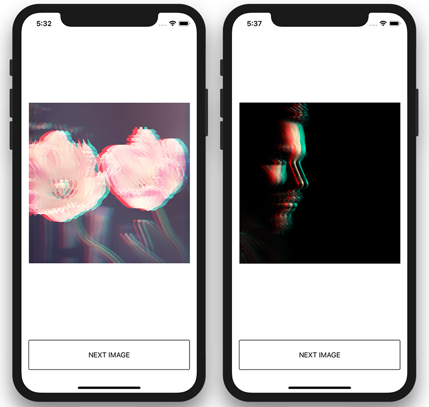

# Operation Layer Example
## Что делает тестовое приложение
1. Загружает картинки из [PixelBay](https://pixabay.com/), как в домашке.
2. Используя последовательность операций:
    1. изменяет размер каждой картинки;
    2. обрезает картинку, делая её квадратной;
    3. применяет к отресайженой и кропнутой картинке фильтр, который имитирует глитч-эффект.



## Как реализовано
* Presentation Layer
* Service Layer
* **Operation Layer**
* Core Layer

Над core-слоем добавлен слой операций, в которые обертываются core-компоненты, для использования сервисами. Как в [COOperation](https://github.com/strongself/COOperation).

## Как выглядит в коде
```swift
func processImage(_ image: UIImage, 
                  completionHandler: @escaping (UIImage?) -> Void) {
    guard let coreImage = CIImage(image: image) else {
        completionHandler(nil)
        return
    }
    let scaleImageOperation = ScaleImageOperation()
    let cropImageOperation = CropImageOperation()
    let filterImageOperation = FilterImageOperation(coreImageFilterManager: coreImageFilterManager)
    let operations = [
        scaleImageOperation,
        cropImageOperation,
        filterImageOperation
    ]
    
    let compoundOperation = CompoundOperation<CIImage, UIImage>(operations: operations, input: coreImage) { (filtredImage, error) in
        if let error = error {
            print(error)
        }
        completionHandler(filtredImage)
    }
    serviceQueue.addOperation(compoundOperation) // compoundOperation.start()
}
```

Для реализации операций используются два класса: `CompoundOperation` и `ChainableOperation`.

## CompoundOperation

Класс, который управляет chainable операциями, и отвечает за их исполнение.

```swift
public class CompoundOperation<Input, Output>: Operation {
    public init(operations: [Operation], 
                input: Input, 
                finishBlock: ((Output?, String?) -> Void)?)
    ...
}
```
Имеет два дженерик-типа, первый для входных данных, второй для выходных.

Например, `CompoundOperation<CIImage, UIImage>` принимает core image, а отдает уже экземпляр класса `UIImage`. 

`input` - это сами данные, экземпляр класса входных данных. И завершающий блок.

## ChainableOperation

Класс, от которого наследуются все кастомные chainable операции. При наследовании переопределяется `main()`.

```swift
open class ChainableOperation<Buffer>: Operation {
    public var bufferValue: Buffer?
    ...
}
```
Имеет один дженерик-тип, который определяет тип выходных данных этой операции. `bufferValue` - это свойство-буфер, в который помещаются выходные данные.

```swift
class FilterImageOperation: ChainableOperation<UIImage> {

    private let coreImageFilterManager: CoreImageFilterManager

    init(coreImageFilterManager: CoreImageFilterManager) {
        self.coreImageFilterManager = coreImageFilterManager
        super.init()
    }

    override func main() {
        let previousBuffer: (value: CIImage?, error: String?) = previousOperationBuffer()
        
        guard let inputImage = previousBuffer.value else {
            error = previousBuffer.error
            return
        }

        let filtredImage =  coreImageFilterManager
                            .processImage(inputImage, withFilter: "Glitch")
                            
        if let coreGraphicsImage =  coreImageFilterManager
                                    .coreImageContext()
                                    .createCGImage(filtredImage,
                                                   from: filtredImage.extent) {
            bufferValue = UIImage(cgImage: coreGraphicsImage)
        } else {
            error = "Filter operation error: failed to create a core graphics representation of the core image."
        }
    }
    
}

```
Например, `FilterImageOperation` берет из буфера предыдущей операции экземпляр класса `CIImage`, а в свой буфер кладет уже экземпляр класса `UIImage`.